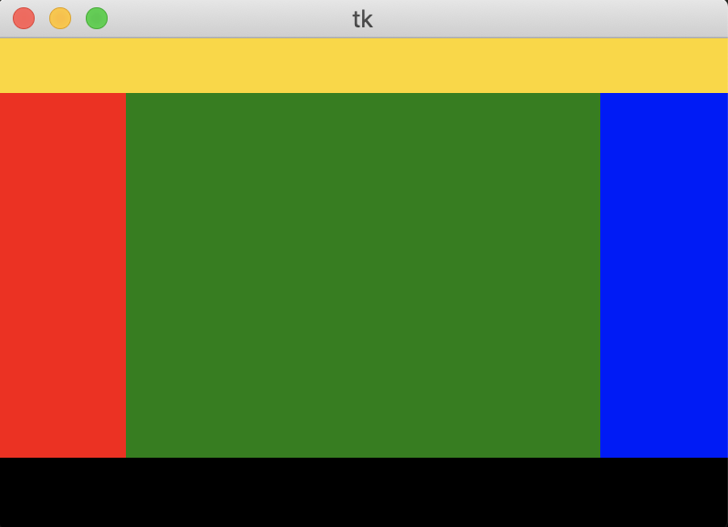
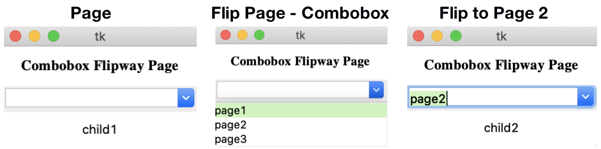

# tkinter_page

## Introduction
Tkinter_page is based on tkinter. It contains several frames that 
used in spcific area. You can build you user interface faster with
tkinter_page.

## Example
### DesktopFrame
``` Python
#This is a example to build an DesktopFrame. 

import tkinter as tk
import tkinter_page as tkp

window = tk.Tk()

# Way1: Generate child frame before DesktopFrame by building a dict
bar_frame = {"background":"gold","width":400,"height":30}
files_frame = {"background":"red","width":70,"height":200}

# Generate a DesktopFrame
bframe = tkp.DesktopFrame(window,log=True,bar_frame=bar_frame,files_frame=files_frame)

# Way2: Generate child frame after DesktopFrame by building a dict
details_frame = {"background":"green","width":260,"height":200}
bframe.set_details_frame(details_frame)
bframe.set_attributes_frame({"background":"blue","width":70,"height":200})

# Way3: Generate child frame after DesktopFrame by building a frame
# If youo use the third way, be careful that you should define the master.
# --------------------------------------------------------------
# |  master     |    child frame                               |
# | base_frame  | bar_frame, logs_frame                        |
# | mid_frame   | files_frame, details_frame, attributes_frame |
# --------------------------------------------------------------
logs_frame = tk.Frame(bframe.base_frame,background="black",width=400,height=40)
bframe.set_logs_frame(logs_frame)

# Pack and Run
bframe.pack()
window.mainloop()
```


### Page
Page can be constructed by combobox style.
``` Python
#This is a example 1 to build an Page. 
#Using Combobox to flip.

import tkinter as tk
import tkinter_page as tkp

window = tk.Tk()

base_frame = tk.Frame(window)

# First we creat three child pages
# We can creat a pack way for a page
def pack_way1():
	print("Use function to define pack way.")
	label1.pack(fill='x',side='bottom')
child1 = tkp.Page(base_frame,pack_way=pack_way1)
label1 = tk.Label(base_frame,text="child1",width=10,height=2)
child1.add_component(label1)

def pack_way2():
	print("Auto pack way is like this.")
	label2.pack()
child2 = tkp.Page(base_frame,pack_way=pack_way2)
label2 = tk.Label(base_frame,text="child2",width=10,height=2)
child2.add_component(label2)

# We can also use auto pack way(do not need a pack way func)
child3 = tkp.Page(base_frame)
label3 = tk.Label(base_frame,text="child3",width=10,height=2)
child3.add_component(label3)

# make child page list
child_page = [child1,child3]
child_page_name = ['page1','page3']

# construct father page - load child page at init
page1 = tkp.Page(base_frame,show_child=True,\
	flip="Combobox",child_page=child_page,\
	child_page_name=child_page_name,current=0,\
	log=False)
label0 = tk.Label(base_frame,text="Combobox Flipway Page",width=20,height=2,\
	font=('Times', '15', 'bold'))
page1.add_component(label0)
# construct father page - add child page at certain place
page1.set_child_page(child2,name='page2',mode='ADD',place=1)

# Pack Father Page
# you can also use
# page1.pack(show_child=True)
# to auto show the current child page
base_frame.pack(fill='both',expand=1)
page1.pack()

window.mainloop()
```


This is another page example with tree style.
``` Python
#This is a example to build an Page. 
#Using Buttom (or other components) to flip.

import tkinter as tk
import tkinter_page as tkp

window = tk.Tk()

base_frame = tk.Frame(window)
# make pages like a tree and use components 
# to flip. 
#   father - 1 
#          \   
#           2 - 2.1
#             \ 2.2
# Be carefull! Tree like pages construct father first!
# make father page
father = tkp.Page(base_frame,show_child=False,flip="Tree")
label0 = tk.Label(base_frame,text="Tree Flipway Page",\
	width=40,height=2,font=('Times', '15', 'bold'))
father.add_component(label0)

# Method ONE
# make page 1 - STRONGLY NOT RECMMENDED
# Of course you can add page in this way, but this is 
# STRONGLY NOT RECMMENDED! You can use page_connect 
# function to connect father page and child page.
# step 1. Define page1 and its components
page1 = tkp.Page(base_frame,flip="Tree")
label1 = tk.Label(base_frame,text="page1",\
	width=40,height=2,font=('Times', '15', 'bold'))
page1.add_component(label1)
# step 2. Manual connect father and child
page1.set_back(father)
father.set_child_page(page1)
def to_page1_func():
	father.front = father.child_page[0]
	father.pack_forget()
	father.front.pack()
to_page1 = tk.Button(base_frame,text='Page 1',command=to_page1_func)
father.add_component(to_page1)

# Method TWO
# make page 2
# Use page_connect method - Audo generate Button
# step 1. Define page2 and its components
page2 = tkp.Page(base_frame,flip="Tree",back=father)
label2 = tk.Label(base_frame,text="page2",\
	width=40,height=2,font=('Times', '15', 'bold'))
page2.add_component(label2)
# step 2. Use connect function
# PS: You need to give "master" for generating flip component.
tkp.page_connect(father=father,child=page2,page_number=1,\
	text='Page 2',master=base_frame)
# page_number is 1 beacuse in the list - 'father.child_page[]', 
# the 'page2' array subscript is 1. ('page1' is 0.)

# Method THREE
# make page 2.1 - The custom generate Button
# step 1. Define page2_1 and its components
page2_1 = tkp.Page(base_frame,flip="Tree",back=father)
label2_1 = tk.Label(base_frame,text="page2_1",\
	width=40,height=2,font=('Times', '15', 'bold'))
page2_1.add_component(label2_1)
# step 2. use "widget" to define the flip component.
to_page2_1 = tk.Button(base_frame,text='Page 2_1',\
	height=3,width=20)
tkp.page_connect(father=page2,child=page2_1,page_number=0,\
	text='Page 2_1',widget=to_page2_1)

# Method FOUR
# make page 2.2 - The custom generate Button
# use "widget" with "flavour" and "command" to define the flip component.
# step 1. Define page2_2 and its components
page2_2 = tkp.Page(base_frame,flip="Tree",back=father)
label2_2 = tk.Label(base_frame,text="page2_2",\
	width=40,height=2,font=('Times', '15', 'bold'))
page2_2.add_component(label2_2)
# step 2. use "widget" and "flavour" to define the flip component.
to_page2_2 = tk.Button(base_frame)
flavor = {'text':'Page 2_2', 'height':3, 'width':20}
# step 3. use "command" to appand function
def hello():
	print("Hello!")
tkp.page_connect(father=page2,child=page2_2,\
	page_number=1,text='Page 2_2',widget=to_page2_2,flavor=flavor,command=hello)

base_frame.pack(fill='both',expand=1)
father.pack()

window.mainloop()
```